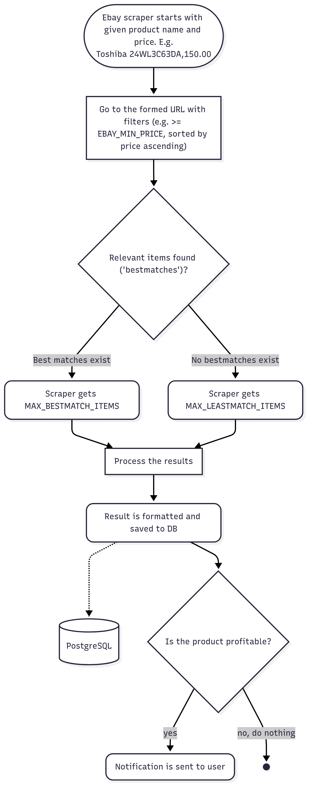
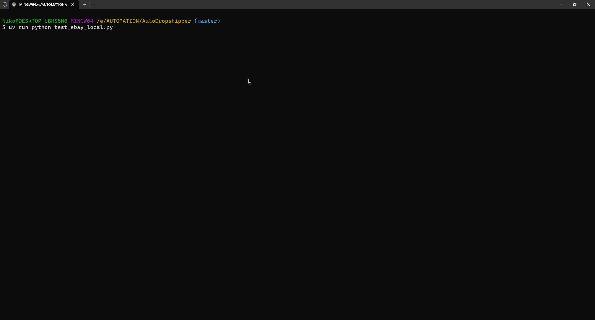
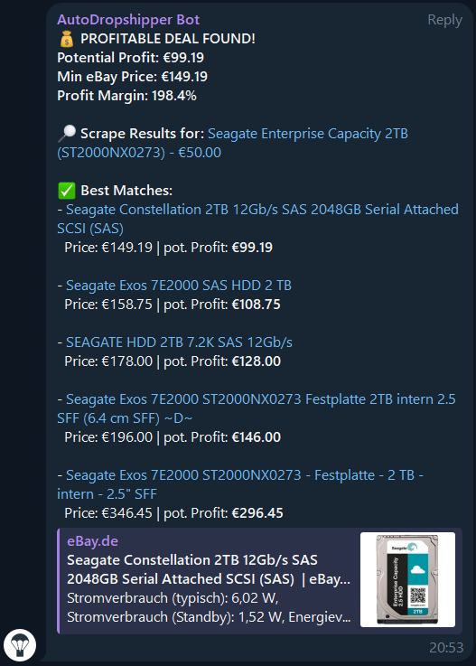
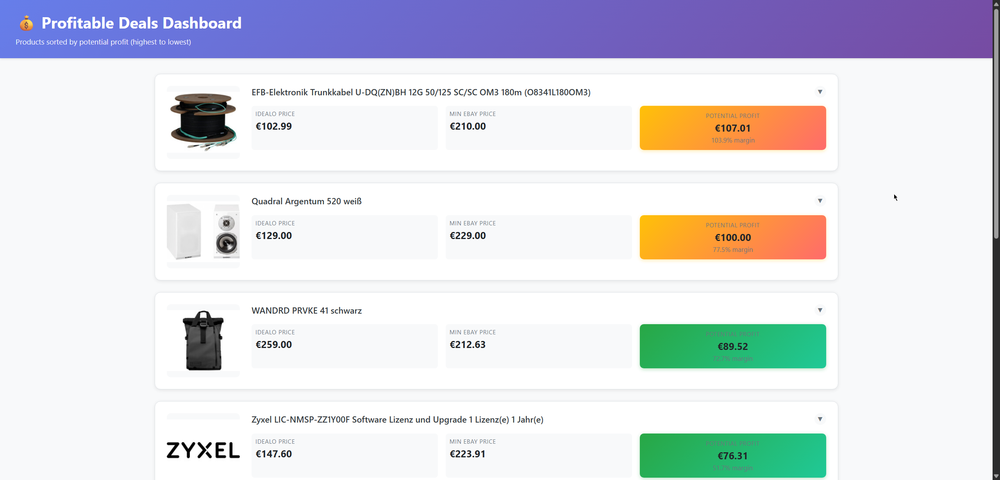

# AutoDropshipper

An automated dropshipping application that scrapes product data from idealo.de, compares prices with eBay listings, and identifies profitable reselling opportunities.

## Tech Stack

- **Python 3.10+**
- **SeleniumBase** 
- **PostgreSQL**
- **Django 5.2**
- **Kubernetes**
- **Docker**
- **UV**
- **Pydantic**

# First, the app will gather top discounted products...


# Next, for each gathered product, app will decide if it's potentially profitable...



## ...by scraping the page:


## If profitable, user receives a notification:



# Profitable deals are collected on the webapp dashboard:



## Quick Start with Docker (Recommended)

### Development Setup

1. **Prerequisites**: Install Docker and Docker Compose

2. **Clone and Setup**:
```bash
git clone <repository-url>
cd AutoDropshipper
```

3. **Environment Configuration**:
   - Copy `.env.example` to `.env`
   - Fill in your database credentials, Telegram tokens, etc.

4. **Start Services**:
```bash
# Start database and web services
docker-compose up db webapp

# Run database migrations
docker-compose run webapp uv run python webapp/manage.py migrate
```

5. **Access the Dashboard**: 
   - Open http://localhost:8000 in your browser

### 🚀 Production Deployment

For production deployment on Linux servers:

1. **Quick Deploy**:
```bash
# Clone repository
git clone <repository-url>
cd AutoDropshipper

# Configure production environment
cp .env.production.example .env.production
# Edit .env.production with your values

# Deploy
chmod +x deploy.sh
./deploy.sh
```

2. **Automated Scheduling** (3x daily with random times):
```bash
# Add to crontab
crontab -e
# Add these lines:
0 6 * * * /path/to/AutoDropshipper/scheduler.sh
0 13 * * * /path/to/AutoDropshipper/scheduler.sh
0 19 * * * /path/to/AutoDropshipper/scheduler.sh
```

See [DEPLOYMENT.md](DEPLOYMENT.md) for detailed production setup instructions.

## Usage

### Docker Commands (Recommended)

**Run Idealo Scraper**:
```bash
docker-compose run scrapers uv run python -m src.scrapers.main --platform idealo --query "gaming laptop"
```

**Run eBay Scraper**:
```bash  
docker-compose run scrapers uv run python -m src.scrapers.main --platform ebay --query "gaming laptop"
```

**Run Full Analysis** (Idealo + eBay + Profitability):
```bash
docker-compose run scrapers uv run python -m src.scrapers.main --platform both --query "gaming laptop" --min-profit 25
```

**Save Results to Database**:
```bash
docker-compose run scrapers uv run python -m src.scrapers.main --platform idealo --query "laptop" --save
```

**View Scraper Help**:
```bash
docker-compose run scrapers
```

### Local Development (Alternative)

If you prefer running without Docker:

1. **Install UV package manager**:
```bash
# On Windows
powershell -c "irm https://astral.sh/uv/install.ps1 | iex"

# On Unix/macOS
curl -LsSf https://astral.sh/uv/install.sh | sh
```

2. **Setup Services**:
```bash
# Install scrapers dependencies
cd src && uv sync

# Install webapp dependencies  
cd ../webapp && uv sync

# Start PostgreSQL locally (or use Docker for just DB)
docker-compose up db

# Run migrations
uv run python webapp/manage.py migrate
```

3. **Run Services**:
```bash
# Start Django webapp
cd webapp && uv run python manage.py runserver

# Run scrapers
cd src && uv run python -m src.scrapers.main --platform idealo --query "laptop"
```

## Project Structure

```
AutoDropshipper/
├── src/                          # Scraping services (modular architecture)
│   ├── Dockerfile               # Chrome + SeleniumBase container
│   ├── pyproject.toml          # Scraper dependencies
│   ├── scrapers/
│   │   ├── main.py             # Unified CLI entry point
│   │   ├── idealo/             # Idealo scraping modules
│   │   └── ebay/               # eBay scraping modules
│   ├── core/
│   │   ├── models/             # Pydantic data models
│   │   ├── utils/              # Business logic
│   │   └── exceptions/         # Custom exceptions
│   ├── database/
│   │   └── repositories/       # Database access layer
│   ├── integrations/
│   │   └── telegram/           # Telegram notifications
│   └── shared/
│       ├── config/             # Configuration management
│       └── logging/            # Structured logging
├── webapp/                       # Django web application
│   ├── Dockerfile              # Lightweight Django container
│   ├── pyproject.toml          # Django dependencies
│   ├── deal_board/             # Main app for product management
│   └── manage.py
├── docker-compose.yml           # Container orchestration
└── docs/                        # Documentation
```

## Development

### Testing

**Run Scraper Tests**:
```bash
# In Docker
docker-compose run scrapers uv run pytest src/

# Locally
cd src && uv run pytest
```

**Run Webapp Tests**:
```bash
# In Docker  
docker-compose run webapp uv run pytest webapp/

# Locally
cd webapp && uv run pytest
```

### Code Quality

**Format Code**:
```bash
# Scrapers
cd src && uv run ruff format .

# Webapp
cd webapp && uv run ruff format .
```

**Linting**:
```bash
# Scrapers
cd src && uv run ruff check .

# Webapp  
cd webapp && uv run ruff check .
```

**Type Checking**:
```bash
# Scrapers
cd src && uv run mypy .

# Webapp
cd webapp && uv run mypy .
```

## Architecture

### Service Architecture

- **Database Service**: PostgreSQL 17.5 (official image)
- **Webapp Service**: Django 5.2 + PostgreSQL client (lightweight)  
- **Scraper Service**: SeleniumBase + Chrome + full automation stack (heavy)

### Data Flow

1. **Scraper** collects products from Idealo.de
2. **Scraper** finds comparable listings on eBay.de  
3. **Profitability Calculator** determines profit margins
4. **Database Repositories** store results
5. **Django Dashboard** displays profitable opportunities
6. **Telegram Bot** sends notifications

## License

[To be determined]