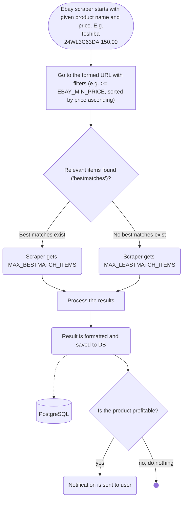

```mermaid
flowchart TD
    B@{ label: "Relevant items found ('bestmatches')?" } -- Best matches exist --> C["Scraper gets MAX_BESTMATCH_ITEMS"]
    B -- "<span style=background-color:>No bestmatches exist</span>" --> n1["Scraper gets MAX_LEASTMATCH_ITEMS"]
    A(["Ebay scraper starts with given product name and price. E.g.<br>Toshiba 24WL3C63DA,150.00"]) --> n3["Go to the formed URL with filters (e.g. &gt;= EBAY_MIN_PRICE, sorted by price ascending)"]
    n3 --> B
    rectId["Process the results"] --> n6["Result is formatted and saved to DB"]
    C --> rectId
    n1 --> rectId
    n6 -.-> n7["PostgreSQL"]
    n6 --> n8["Is the product profitable?"]
    n8 -- yes --> n9["Notification is sent to user"]
    n8 -- no, do nothing --> n10["Untitled Node"]
    B@{ shape: diam}
    C@{ shape: rounded}
    n1@{ shape: rounded}
    rectId@{ shape: proc}
    n6@{ shape: event}
    n7@{ shape: db}
    n8@{ shape: diam}
    n9@{ shape: rounded}
    n10@{ shape: f-circ}
```